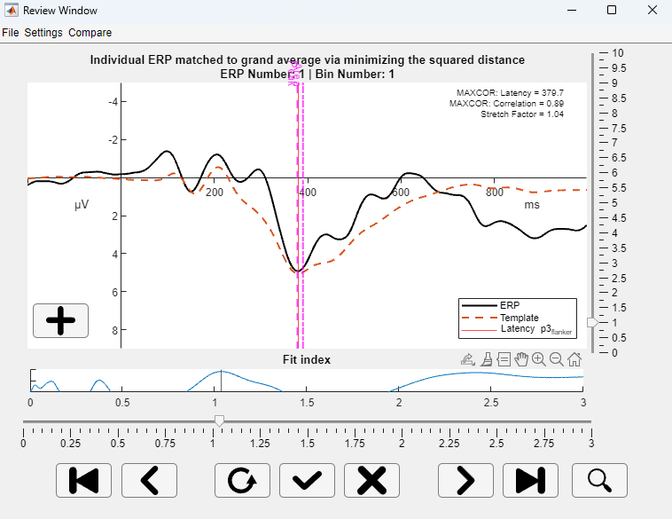
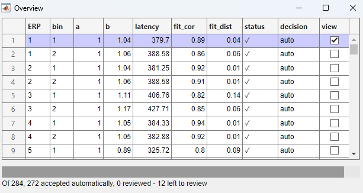

# 🧠 Template Matching for Subject-Level ERP Detection

This repository provides tools to apply **template matching using the grand average ERP** to detect components in subject-level EEG data. The approach aligns individual ERPs to a group-level template using correlation or distance metrics, with optional weighting and penalty functions for flexible, component-specific tuning.

The review app provides an interactive environment to inspect and refine component detection:

* **Main review window**: Shows the ERP, template match, and fit information for a given latency estimate. You can **accept**, **adjust**, or **reject** matches manually.



*Figure: Screenshot of the review interface showing the matched template and ERP with interactive options for review and adjustment.*


* **Overview table**: Displays all subject ERPs along with match statistics and review status. Use the *View* button to inspect any individual ERP.



*Figure: Screenshot of the overview table showing match statistics and indicating review status.*

📄 **Preprint**  
For methodological details, please refer to our [preprint on Authorea](https://doi.org/10.22541/au.173383976.68997762/v1).

---

## 🚀 Getting Started

### 1. Clone or Download the Repository

Clone via Git:

```bash
git clone https://github.com/slesche/template-matching-app.git
cd template-matching-app
````

Or download it directly as a ZIP file and extract the contents.

### 2. Explore the Example Data and Script

The repository includes:

* Example EEG data
* Example scripts demonstrating the complete processing and review pipeline

Use these resources to test your setup or as templates for your own data workflows.

---

## 🧠 Data Requirements

Data must be formatted as a **subject × channels × time × conditions** matrix.

If you're using **EEGlab**, a helper function is available:

```matlab
data = convert_eeglab_to_rawdata(EEG);
```

---

## ⚙️ Configuration Setup

Before running the algorithm, configure the matching parameters in a `cfg` struct:

```matlab
cfg = struct();
cfg.approach = "maxcor";                        % Matching approach: currently - maximize correlation
cfg.weight = "get_normalized_weights";          % Weighting function
cfg.penalty = "exponential_penalty";            % Penalty function
cfg.normalization = "none";                     % Template normalization
cfg.use_derivative = 0;                         % Use temporal derivative? (0 = no)
cfg.component_name = "p3_flanker";              % Component label
cfg.polarity = "positive";                      % Expected polarity (positive/negative)
cfg.electrodes = 11;                            % Index of electrode
cfg.window = [250 700];                         % Time window (in ms)
cfg.cutoff = 0.6;                                % Fit cutoff for review
cfg.extreme_b = 1.5;                             % Cutoff for extreme latencies
```

These parameters are fully customizable. You can implement and specify your own weighting and penalty functions by name in the configuration.

> 💡 **For P3 detection**, we recommend `get_normalized_weights` with an `exponential_penalty` and a window that includes the full P3 component and some preceding activity.

⚠️ Currently, the algorithm operates on a single electrode (though averaging is possible before passing the data).

---

## ⚙️ Running the Algorithm

To optimize performance, we recommend running the algorithm and saving the results before launching the review app.

### With Parallel Processing Toolbox:

```matlab
results_mat = run_template_matching(erp_data, time_vec, cfg);
```

### Without Parallel Processing Toolbox:

```matlab
results_mat = run_template_matching_serial(erp_data, time_vec, cfg);
```

---

## 🧾 Using the Review App

Launch the app with:

```matlab
review_app;
```

And provide the data, configuration struct and results.

The review app provides an interactive environment to inspect and refine component detection:

* **Main review window**: Shows the ERP, template match, and fit information for a given latency estimate. You can **accept**, **adjust**, or **reject** matches manually.


*Figure: Screenshot of the review interface showing the matched template and ERP with interactive options for review and adjustment.*


* **Overview table**: Displays all subject ERPs along with match statistics and review status. Use the *View* button to inspect any individual ERP.


*Figure: Screenshot of the overview table showing match statistics and indicating review status.*

Use the preferences menu (*Settings > Preferences > Overview Table*) to filter and customize the overview table display.

> 💡 Start with a liberal cutoff (e.g., `0.7`) to explore the matching behavior across subjects. Once you're familiar with the results, fine-tune the cutoff and `extreme_b` parameter to match your review goals.

---

## 📁 Repository Structure

* `functions/` – Core template matching algorithms and utilities
* `app/` – MATLAB App components and interface logic
* `data/` – Example data
* `S_testing_app.m` - Example script

---

## 🛠️ Customization

The framework is flexible and extensible. You can:

* Implement your own weighting or penalty functions
* Modify or replace the matching algorithm
* Adapt configurations to fit different components or data modalities

---

## 🐛 Issues and Feedback

Found a bug? Have a question? Want to suggest a feature?

We welcome contributions and feedback!
Please [open an issue](https://github.com/slesche/template-matching-app/issues) to start the conversation.

---
